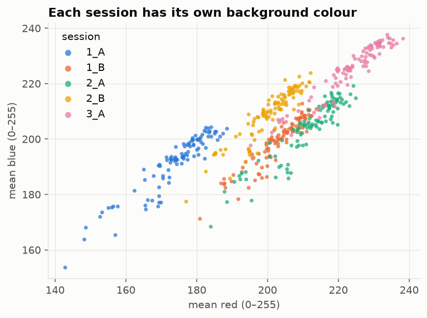
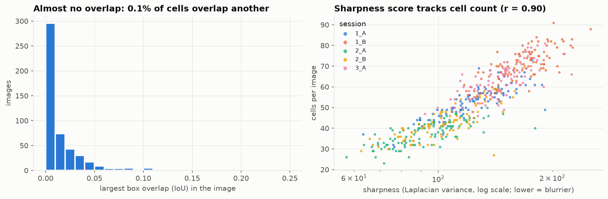
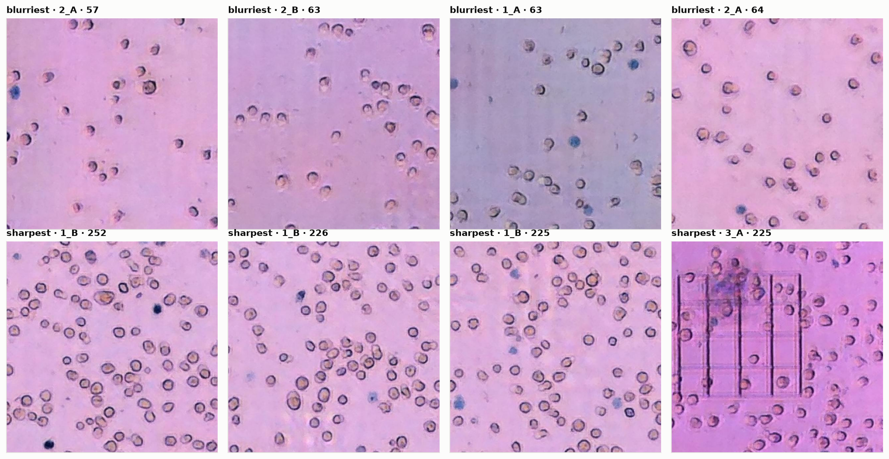

# EDA Summary: Roboflow Live/Dead Cell Counting

Phase 1 summary for the team. It condenses `notebooks/01_eda.ipynb` (full analysis and code) into the findings that shape modeling. The figures in `figures/eda/` were rebuilt from the raw export (500 images) on 2026-10-06. The roadmap is in [`plan.md`](plan.md).

**TL;DR**
1. **500 unique images, 26,715 labelled cells, two classes** (Live 96% / Dead 4%). The public "~1,200 image" version is the same 500 images with augmented copies ([details](dataset_link.md#why-the-public-version-shows-1200-images-verified-2026-10-06)).
2. **One lab, one day, five sessions.** The session alone explains **72% of the count variance** (R² = 0.72) and is visible from the background colour. A model can score well by recognizing the session instead of counting cells, so every result must also be reported on leave-one-session-out cross-validation.
3. **Cells are easy individually:** uniform (~28 px), sparse, and almost never overlapping. This set **cannot test** the project's dense, overlapping, or blurry goals; those need other datasets.
4. **For per-image regression the data is small** (351 training images), but large for detection (≈18,600 training cells). This favours detection-style models.

---

## 1. What the data looks like

| | |
|---|---|
| Images | 500, all 640×640 RGB brightfield, none empty, unreadable, or near-duplicate (perceptual hash) |
| Labels | 26,715 boxes: **Live 25,691**, **Dead 1,024** (blue-stained, consistent with a trypan-blue viability assay) |
| Cells per image | 23–91 (median 54) |
| Sources | `2022_12_7_{1_A, 1_B, 2_A, 2_B, 3_A}`, 100 frames each, parsed from the file names |

## 2. The main risk: the session predicts the count

| Session | Mean count | Std | Range | Dead % |
|---|---|---|---|---|
| 1_A | 53.1 | 7.9 | 31–73 | 3.6 |
| 1_B | 71.1 | 7.8 | 55–91 | 3.9 |
| 2_A | 37.5 | 5.8 | 23–50 | 3.8 |
| 2_B | 43.3 | 8.3 | 27–70 | 4.3 |
| 3_A | 62.2 | 8.5 | 43–81 | 3.9 |

Predicting each image's session mean already gives **R² = 0.72**, without looking at a single cell. The session is also easy to see:

Each session has its own background tint (1_A is bluish-grey, 3_A is the most saturated pink), and k-means on mean colour mostly recovers the sessions. Together, these mean:
- A random split rewards session recognition. **Leave-one-session-out cross-validation** (train on 4 sessions, test on the 5th) is the honest test, and the gap between the two scores is a key result.
- Colour augmentation should shift the background freely but **keep the blue Live/Dead cue**; no full grayscale conversion and only small hue shifts.

## 3. Cells: size, class balance, overlap

- **Size:** about 28 px across (IQR 25–31 px), roughly square. Dead cells have the same median size but a wider spread. No resizing is needed at 640 px, and downscaling to 320 px would still leave cells about 14 px across.
- **Class balance:** Dead is only 3.8% of cells (0–14% per image). Report **Live and Dead errors separately**, plus viability %, or the Dead error disappears into the total.
- **Label outliers:** 29 boxes in 27 images are extreme in size (> 3×IQR). The ones checked are real large cells or clumps, so they are kept. 4.7% of boxes touch the image border, and the labels count these cut-off cells.

- **Overlap is negligible:** median per-image max IoU is 0.006, and 0.1% of cells overlap another. The dense and overlapping case in the project goals is **not represented**.
- **The sharpness metric is confounded.** Laplacian variance, the usual blur score, correlates **r = 0.90 with cell count**, because more cells means more edges. It doesn't measure focus quality on this data. Two consequences:
  - Blur robustness must be tested by **adding blur at controlled strengths** (stress tests), not by sorting images by this score.
  - A trivial "edge energy → count" regression will already look good on this data. That's a shortcut baseline worth reporting (see `plan.md` Phase 2).

The "blurriest" images are mostly the sparse ones and the "sharpest" the crowded ones, which confirms the confound. Faint, out-of-focus cells are often **unlabelled**, so the ground truth counts in-focus cells only. Classical methods (threshold or watershed) will over-count unless they filter for focus or contrast.

## 4. Shared split

`splits/splits.csv` (committed) replaces Roboflow's split, which was unbalanced: its test set had 5 images from 2_A and 14 from 3_A.
- **351 / 74 / 75** (train / valid / test), stratified by session × count quartile, so every session and density range sits in every split at about 70/15/15.
- Leave-one-session-out folds come from the `source` column of the same file.

## 5. Preprocessing decisions

| Question | Decision |
|---|---|
| Inclusion / exclusion | Keep all 500 images, including extreme-size boxes and border cells. Don't use the public augmented version. |
| Resolution | Native 640×640; tile larger inputs later, and never stretch. |
| Colour | RGB, per-image or ImageNet normalization; background colour jitter, but small hue shifts only. |
| Augmentation | Flips and 90° rotations (count-preserving), mild blur, noise, random crops and zoom. |
| Targets | Boxes (detection), total, Live and Dead counts (regression), or Gaussian density maps (σ ≈ 4–7 px). |
| Evaluation | Random split for development, **leave-one-session-out for headline numbers**, plus stress tests for blur, scale, and colour. |

## 6. What this data cannot answer

| Project goal | Covered here? | Where to get it |
|---|---|---|
| Count accuracy on sparse brightfield cells | ✅ | this dataset |
| New labs, microscopes, stains | ❌ (one lab, one day) | external test set (Stretch 2) |
| High density, overlapping cells | ❌ (0.1% overlap) | Synthetic Cell Images and Masks; CoNIC (histology nuclei) |
| Poor focus / blur | ⚠️ only mild, and the score is confounded | stress tests with added blur; synthetic set with blur levels |

---

_Figures: built on 2026-10-06 with a one-off plotting script that reuses `cellcount.eda` (the script isn't in the repo yet; the same analyses are in `notebooks/01_eda.ipynb`)._
