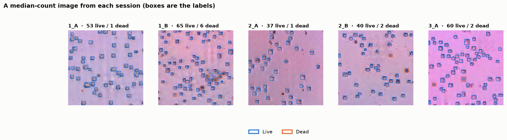
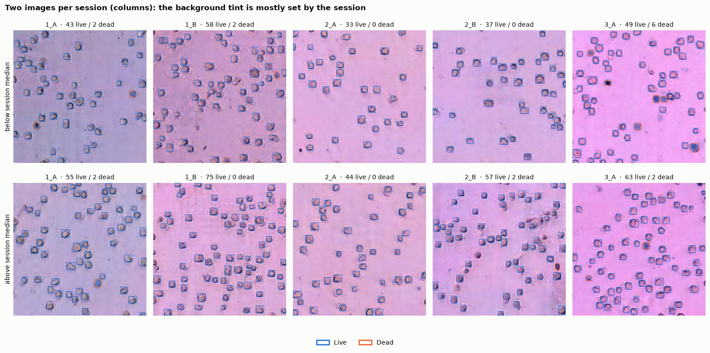
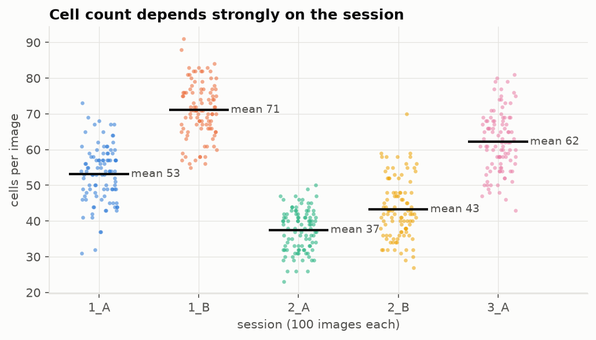
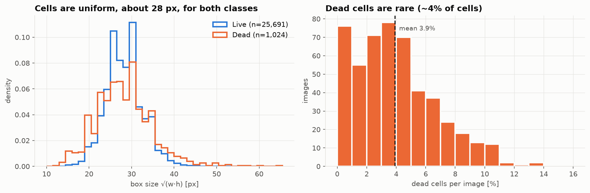
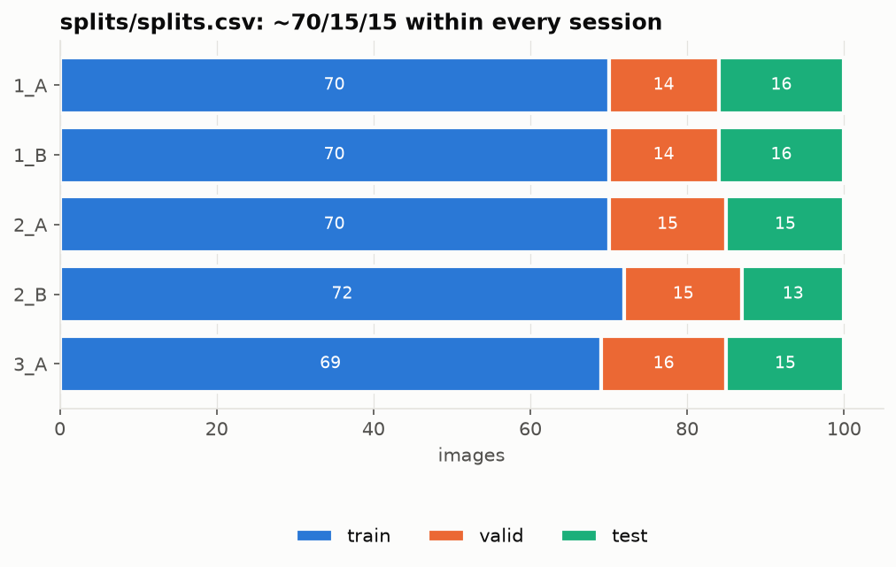

# Week 2 Check-in: Exploratory Data Analysis and Preprocessing

[← Check-in index](required_checkin_items.md) · Status: ✅ ready to submit · Full write-up with all figures: [`eda_summary.md`](../eda_summary.md) · Code: `notebooks/01_eda.ipynb`

**Project scope (refined this week):** the tool **finds and circles every cell, labels it Live or Dead, then counts the detections**. Counts and viability % are tallies of what was found, so each number can be checked against the annotated image.

## 1. Dataset uploaded to our workspace

- **Primary dataset:** Roboflow *Cell Counting* ([public page](https://universe.roboflow.com/cell-counting/cell-counting-zeqo5)), forked into our Roboflow workspace and exported raw in COCO format (no resizing or augmentation).
  - Anyone on the team can download it with `notebooks/00_setup_and_download.ipynb`, locally or on Google Colab (shared Drive folder). Setup is in `data/README.md`.
- **Correction to week 1:** the "1,200 images" figure counted augmented copies. We downloaded the public version and matched it image by image against our raw export:
  - It holds the same **500 unique images**, with identical labels.
  - Its 1,050 training images are 350 originals × 3 noisy copies.
  - We use only the 500 originals. Training on the copies would leak test images into training. Details are in [`dataset_link.md`](../dataset_link.md).

## 2. Basic exploratory data analysis

| | |
|---|---|
| Images | 500, all 640×640 RGB brightfield; none empty, unreadable, or duplicated |
| Labels | 26,715 cell boxes: **Live 25,691 (96%)**, **Dead 1,024 (4%)**, the blue-stained cells of a trypan-blue viability assay |
| Cells per image | 23–91 (median 54) |
| Sources | One lab, one day (`2022_12_7`), **5 imaging sessions** × 100 images |

**Key insights**
1. **Each session has its own look and typical count.** Session means range from 37 to 71 cells, and the background tint mostly identifies the session.
   - Knowing only the session predicts the count with R² = 0.72.
   - A model that guesses one number per image could exploit this. Our detector has to find each cell, but we still test on **unseen sessions** to make sure detection doesn't depend on the background.

2. **Cells are uniform and well separated:** about 28 px across, the same size for Live and Dead, and only 0.1% of cells overlap another. This suits a standard object detector at native resolution.
   - It also means this dataset **cannot test** the dense or overlapping cases in our goals; those need other datasets.
3. **Dead cells are rare** (0–14% per image, mean 3.9%), so we report Live and Dead errors separately, plus viability %.

4. **The usual blur score is misleading here.** Laplacian variance correlates r = 0.90 with the cell count (more cells, more edges), so it doesn't measure focus. We'll test blur robustness by adding blur at controlled strengths.
5. **Label policy:** faint, out-of-focus cells are often unlabelled, so the ground truth counts in-focus cells. Classical threshold methods will tend to over-count.

## 3. Preprocessing insights

**1. Inclusion / exclusion: keep all 500 images.** None are empty, duplicated, or unreadable.
- 29 unusually large or small boxes (in 27 images) were checked; they are real large cells or clumps, so we keep them.
- Cells cut off at the image border (4.7% of boxes) are labelled and counted, and we keep that rule.
- We exclude the public augmented version.

**2. Transformations before the model:**
- **No resizing:** keep native 640×640, since cells are already a good size for detectors. Larger inputs will later be tiled, never stretched.
- **Colour:** keep RGB. Dead cells are recognized by their blue stain, so no grayscale. Normalize per channel (ImageNet statistics for pretrained backbones).
- **Augmentation:**
  - flips and 90° rotations (these don't change the count)
  - brightness, contrast, and background-colour jitter with **only small hue shifts**, to protect the blue Live/Dead cue
  - mild blur and noise
  - random crops and zoom
- **Targets:** boxes with Live/Dead labels; counts are tallies of the boxes.

**3. Train / validation / test split:**
- We made our own shared split, `splits/splits.csv`: **351 / 74 / 75 images (70/15/15)**, stratified by session × count range, so each session and density level appears in every split.
  - Roboflow's own split was unbalanced; its test set had 5 images from one session and 14 from another.

- **Is it enough to avoid overfitting?** For a model that predicts one number per image, 351 training images is little. For a **detector**, every cell is a training example: about 18,600 labelled cells in the training split, which is ample. This is one reason we chose detect, then count. We'll also use:
  - pretrained weights
  - strong augmentation
  - early stopping on the validation set
- **Generalization check:** besides the random split, we will report **leave-one-session-out cross-validation**: train on 4 sessions and test on the 5th. With only 5 sessions from one lab, that is our most honest test, and the gap between the two scores is a key result.

## Next week (week 3)

- Baseline ladder, from simple to learned: mean count; classical image processing (threshold and watershed, plus a colour rule for Live/Dead); Cellpose with no training; and a default YOLO detector.
- Foundation-model comparison: MedGemma prompting and frozen MedSigLIP features.
- A shared metrics module: detection precision and recall; Live, Dead, and Total count errors; viability error; R².
- Decide which public datasets to use for "what is a cell" pretraining (LIVECell, BCCD, synthetic). See `plan.md` §5.3.
